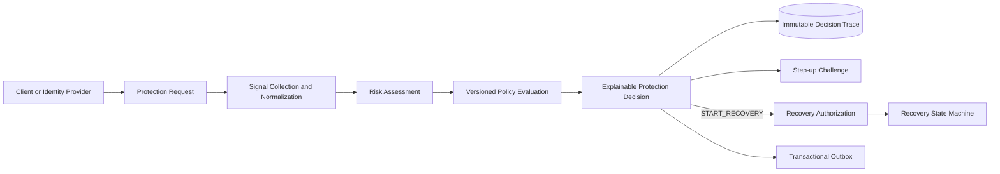

# AccountShield Orchestrator

[](https://github.com/vinicius-ssantos/accountshield-orchestrator/actions/workflows/ci.yml)

> Adaptive account-protection decision and orchestration platform with explainable risk policies, step-up challenges, secure recovery, abuse detection, replay, and security simulation.

AccountShield is a portfolio-grade backend platform that evaluates security-sensitive account events and decides whether they should be allowed, monitored, challenged, temporarily blocked, or routed into a secure recovery flow.

The project focuses on the difficult engineering behind account protection: explainable decisions, policy versioning, idempotency, concurrency, state machines, auditability, replay, safe policy rollout, observability, and failure handling. It is **not** intended for real-world authentication or production fraud decisions.

## Why this project exists

Applications with authentication need to answer questions such as:

- Is this login normal for the account?
- Should a password change require stronger verification?
- Is a recovery attempt legitimate or abusive?
- Can a new risk policy be released without locking out valid users?
- Can a historical decision be explained and reproduced later?

AccountShield receives account, session, device, network, and behavioral context; evaluates versioned risk policies; persists an immutable decision trace; and orchestrates the next protection action.

## Product boundary

AccountShield is a **decision and orchestration layer**. It is not a replacement for Keycloak, Auth0, Amazon Cognito, or an identity provider.

### In scope

- protection requests for login, recovery, credential change, and sensitive actions;
- normalized risk signals and weighted contributions;
- versioned and explainable policies;
- decisions such as `ALLOW`, `REQUIRE_STEP_UP`, `TEMPORARILY_BLOCK`, and `START_RECOVERY`;
- challenge lifecycle and retry protection;
- secure recovery state machine;
- idempotency, replay protection, rate limits, and cooldowns;
- immutable audit trail;
- deterministic replay and shadow-policy comparison;
- security scenario simulation;
- operational metrics, traces, and structured logs.

### Explicitly out of scope

- storing user passwords;
- issuing production identity tokens;
- real biometric verification;
- real SMS, e-mail, or payment-provider integrations in the first releases;
- machine-learning-based fraud scoring in the MVP;
- production use for security or financial decisions.

## Core flow



A decision response is expected to expose both the outcome and its reasoning:

```json
{
  "decisionId": "dec_01J...",
  "decision": "REQUIRE_STEP_UP",
  "riskScore": 78,
  "riskLevel": "HIGH",
  "reasons": [
    { "code": "NEW_DEVICE", "contribution": 20 },
    { "code": "IMPOSSIBLE_TRAVEL", "contribution": 35 },
    { "code": "RECENT_PASSWORD_CHANGE", "contribution": 23 }
  ],
  "requiredChallenge": "WEBAUTHN_SIMULATED",
  "policyVersion": "2026.07.1"
}
```

## Architecture

The system starts as a modular monolith. Module boundaries are treated as architectural contracts and can evolve into independently deployable services only when operational evidence justifies the split.

Modules:

| Module | Responsibility |
| --- | --- |
| `protection` | Request intake, use-case orchestration, idempotency, and decision API |
| `risk` | Deterministic risk assessment from normalized signals |
| `policy` | Versioned policy evaluation, lifecycle state machine, and shadow mode |
| `challenge` | Step-up challenge lifecycle, attempts, expiry, and retry budget |
| `recovery` | Expirable recovery authorization, secure state machine, risk gates, challenge binding, delay, and manual review |
| `audit` | Immutable decision trace, replay query API, and security audit events |
| `outbox` | Transactional outbox with scheduled relay and pluggable publisher port |
| `simulation` | Deterministic historical replay and shadow-policy comparison |

Start with the canonical [`documentation map`](docs/README.md). It links the [feature catalog](docs/features/README.md), [architecture baseline](docs/architecture/README.md), [executable invariants](docs/architecture/invariants.md), [ADR index](docs/adr/README.md), and [delivery roadmap](docs/roadmap.md).

## Engineering principles

1. **Explainability is part of the domain model.** A reason is not a log message added after the decision.
2. **Historical decisions are immutable.** Policy changes do not rewrite prior outcomes.
3. **Policies are versioned.** Every decision records the exact policy version used.
4. **Replay is deterministic.** Equal inputs and equal policy versions produce equal outcomes.
5. **External effects are idempotent.** Retries must not create duplicate challenges or events.
6. **Recovery is a state machine.** It is not a single endpoint that resets a credential.
7. **Secure defaults win.** Sensitive data is minimized and operational endpoints are deliberately exposed.
8. **The modular monolith is intentional.** Distribution is earned through evidence, not assumed at project start.

## Technology direction

- Java 25 LTS;
- Spring Boot 4.1;
- Maven;
- Spring Modulith;
- PostgreSQL and Flyway;
- Testcontainers;
- ArchUnit;
- Micrometer metrics and structured logging;
- OpenTelemetry tracing planned under issue #24;
- Docker Compose;
- GitHub Actions.

Exact dependency versions are pinned in the build and upgraded through reviewed pull requests.

## Current delivery status

The authoritative capability status is maintained in the [feature catalog](docs/features/README.md). The catalog distinguishes implemented, partial, planned, and deferred behavior and links every known gap to an issue.

### Implemented foundation

- modular-monolith boundaries verified by Spring Modulith and architecture tests;
- PostgreSQL/Flyway source of truth with Hibernate schema validation;
- deterministic risk assessment and versioned policy lifecycle;
- explainable outcomes and append-only decision traces;
- purpose-bound challenge lifecycle using simulated providers;
- risk-gated recovery state machine;
- explicit immutable, expirable, single-use recovery authorization;
- deterministic policy replay/shadow evaluation baseline;
- transactional outbox and simulated relay baseline;
- structured security logs, metrics, Maven verification, and Docker build.

### Important partial areas

- concurrent recovery initiation and optimistic locking: issues #18 and #37;
- concurrent protection idempotency: issue #22;
- challenge secrecy and provider-specific behavior: issues #20 and #38;
- complete historical algorithm replay/provenance: issues #21 and #43;
- stable RFC 9457 problem-code catalog: issue #36;
- outbox claiming, backoff, and dead letters: issue #23.

### Not yet delivered

Authentication/RBAC, privileged step-up authorization, maker-checker policy governance, client isolation, signed webhooks, cryptographic audit chaining, distributed tracing, production-grade challenge providers, operator mutations, SDK/CLI releases, and a reproducible 1.0 release remain planned.

See the [dependency-ordered roadmap](docs/roadmap.md) for the implementation sequence. Open pull requests are not classified as delivered until merged into `main`.

## Local development

### Quick start with Docker Compose

```bash
docker compose up -d
```

This starts:

| Service | Port | Purpose |
| --- | --- | --- |
| PostgreSQL 17 | `5432` | Primary data store |
| AccountShield app | `8080` | REST API + actuator + Swagger UI |
| Prometheus | `9090` | Metrics scraping |
| Grafana | `3000` | Dashboards (admin/admin) |

The Grafana dashboard is auto-provisioned from `grafana/accountshield-dashboard.json`.

Interactive API docs are available at `http://localhost:8080/swagger-ui.html` once the application is running.

### Developer workflow

```bash
docker compose up -d postgres

./mvnw verify

./mvnw spring-boot:run
```

No production credentials are required. All external challenge providers are simulated locally.

## Security notice

This repository is an educational and portfolio project. It must not be used as the sole protection mechanism for real accounts, authentication systems, financial transactions, or regulated workloads.

Security reports should avoid disclosing secrets or personal information in public issues. See [`SECURITY.md`](SECURITY.md) once the foundation milestone is merged.

## License

Licensed under the [MIT License](LICENSE).
