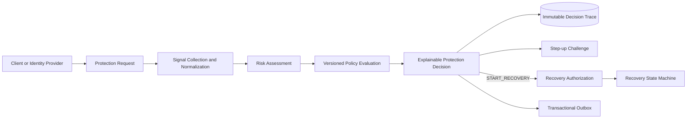

# AccountShield Orchestrator

[](https://github.com/vinicius-ssantos/accountshield-orchestrator/actions/workflows/ci.yml)

> Adaptive account-protection decision and orchestration platform with explainable risk policies, step-up challenges, secure recovery, abuse detection, replay, and security simulation.

AccountShield is a portfolio-grade backend platform that evaluates security-sensitive account events and decides whether they should be allowed, monitored, challenged, temporarily blocked, or routed into a secure recovery flow.

The project focuses on the difficult engineering behind account protection: explainable decisions, policy versioning, idempotency, concurrency, state machines, auditability, replay, safe policy rollout, observability, and failure handling. It is **not** intended for real-world authentication or production fraud decisions.

## Why this project exists

Applications with authentication need to answer questions such as:

- Is this login normal for the account?
- Should a password change require stronger verification?
- Is a recovery attempt legitimate or abusive?
- Can a new risk policy be released without locking out valid users?
- Can a historical decision be explained and reproduced later?

AccountShield receives account, session, device, network, and behavioral context; evaluates versioned risk policies; persists an immutable decision trace; and orchestrates the next protection action.

## Product boundary

AccountShield is a **decision and orchestration layer**. It is not a replacement for Keycloak, Auth0, Amazon Cognito, or an identity provider.

### In scope

- protection requests for login, recovery, credential change, and sensitive actions;
- normalized risk signals and weighted contributions;
- versioned and explainable policies;
- decisions such as `ALLOW`, `REQUIRE_STEP_UP`, `TEMPORARILY_BLOCK`, and `START_RECOVERY`;
- challenge lifecycle and retry protection;
- secure recovery state machine;
- idempotency, replay protection, rate limits, and cooldowns;
- immutable audit trail;
- deterministic replay and shadow-policy comparison;
- security scenario simulation;
- operational metrics, traces, and structured logs.

### Explicitly out of scope

- storing user passwords;
- issuing production identity tokens;
- real biometric verification;
- real SMS, e-mail, or payment-provider integrations in the first releases;
- machine-learning-based fraud scoring in the MVP;
- production use for security or financial decisions.

## Core flow


```mermaid
flowchart LR
    Client[Client or Identity Provider] --> Intake[Protection Request]
    Intake --> Signals[Signal Collection and Normalization]
    Signals --> Risk[Risk Assessment]
    Risk --> Policy[Versioned Policy Evaluation]
    Policy --> Decision[Explainable Protection Decision]
    Decision --> Audit[(Immutable Decision Trace)]
    Decision --> Challenge[Step-up Challenge]
    Decision -- START_RECOVERY --> Authorization[Recovery Authorization]
    Authorization --> Recovery[Recovery State Machine]
    Decision --> Events[Transactional Outbox]
```

A decision response exposes both the outcome and its reasoning -- this is the real, current
`POST /api/v1/protection-decisions` response shape (see `docs/demo/curl-walkthrough.md` to produce
it live):

```json
{
  "decisionId": "5b1e...-uuid",
  "protectionRequestId": "a37f...-uuid",
  "recoveryAuthorizationId": null,
  "outcome": "REQUIRE_STEP_UP",
  "riskScore": 60,
  "riskBand": "MEDIUM",
  "algorithmVersion": "risk-v1",
  "policyKey": "account-protection-default",
  "policyVersion": "1.1.0",
  "reasons": [
    { "code": "IMPOSSIBLE_TRAVEL", "contribution": 35 },
    { "code": "NETWORK_RISK_MEDIUM", "contribution": 10 },
    { "code": "NEW_DEVICE", "contribution": 15 }
  ],
  "decidedAt": "2026-07-28T00:00:00Z",
  "challenge": { "challengeId": "c9d4...-uuid", "challengeType": "TOTP_SIMULATED", "expiresAt": "2026-07-28T00:05:00Z" },
  "degraded": false,
  "degradationReason": null
}
```

## Architecture

The system starts as a modular monolith. Module boundaries are treated as architectural contracts and can evolve into independently deployable services only when operational evidence justifies the split.

Modules:

| Module | Responsibility |
| --- | --- |
| `protection` | Request intake, use-case orchestration, idempotency, and decision API |
| `risk` | Deterministic risk assessment from normalized signals |
| `policy` | Versioned policy evaluation, lifecycle state machine, and shadow mode |
| `challenge` | Step-up challenge lifecycle, attempts, expiry, and retry budget |
| `recovery` | Expirable recovery authorization, secure state machine, risk gates, challenge binding, delay, and manual review |
| `audit` | Immutable, hash-chained decision trace, replay query API, and security audit events |
| `outbox` | Transactional outbox with `SKIP LOCKED` claiming, backoff, and dead letters |
| `webhook` | Signed, replay-protected outbound webhook delivery |
| `simulation` | Deterministic historical replay, shadow-policy comparison, and policy impact analysis |
| `evidence` | Signed, redacted decision evidence bundle export and verification |
| `crypto` | Envelope encryption, KEK rotation, and crypto-shredding for sensitive fields |

Start with the canonical [`documentation map`](docs/README.md). It links the [feature catalog](docs/features/README.md), [architecture baseline](docs/architecture/README.md), [executable invariants](docs/architecture/invariants.md), [ADR index](docs/adr/README.md), and [delivery roadmap](docs/roadmap.md).

## Engineering principles

1. **Explainability is part of the domain model.** A reason is not a log message added after the decision.
2. **Historical decisions are immutable.** Policy changes do not rewrite prior outcomes.
3. **Policies are versioned.** Every decision records the exact policy version used.
4. **Replay is deterministic.** Equal inputs and equal policy versions produce equal outcomes.
5. **External effects are idempotent.** Retries must not create duplicate challenges or events.
6. **Recovery is a state machine.** It is not a single endpoint that resets a credential.
7. **Secure defaults win.** Sensitive data is minimized and operational endpoints are deliberately exposed.
8. **The modular monolith is intentional.** Distribution is earned through evidence, not assumed at project start.

## Technology direction

- Java 25 LTS;
- Spring Boot 4.1;
- Maven;
- Spring Modulith;
- PostgreSQL and Flyway;
- Testcontainers;
- ArchUnit;
- Micrometer metrics, structured logging, and OpenTelemetry tracing (OTLP + Jaeger);
- Docker Compose;
- GitHub Actions.

Exact dependency versions are pinned in the build and upgraded through reviewed pull requests.

## Current delivery status

The authoritative capability status is maintained in the [feature catalog](docs/features/README.md), which distinguishes implemented, partial, planned, and deferred behavior and links every known gap to an issue. This section is a summary, not the source of truth -- if it ever disagrees with the feature catalog, the feature catalog wins.

### Implemented

- modular-monolith boundaries verified by Spring Modulith and architecture tests;
- PostgreSQL/Flyway source of truth with Hibernate schema validation;
- deterministic risk assessment and versioned policy lifecycle, with maker-checker approval, a static policy analyzer/linter, historical impact analysis, and deterministic canary rollout;
- explainable outcomes and append-only, tamper-evident (hash-chained) decision traces;
- purpose-bound challenge lifecycle using simulated providers, hardened against concurrent verification and blocked outright under a production-like profile;
- risk-gated recovery state machine with an explicit, immutable, expirable, single-use recovery authorization;
- deterministic policy replay by versioned algorithm registry, with full provenance;
- signed, redacted, independently-verifiable decision evidence bundles;
- JWT resource-server authentication and role-based authorization on every sensitive API, plus fresh purpose-bound step-up for privileged operations;
- concurrency-safe idempotency (protection decisions and recovery initiation), transactional outbox with `SKIP LOCKED` claiming/backoff/dead letters, and signed webhook delivery with replay protection;
- envelope encryption/key rotation/crypto-shredding, database least-privilege roles, and a data classification/pseudonymization/retention model;
- transaction-aware observability, distributed tracing (Micrometer + OTLP + Jaeger), a resilience/concurrency fault-injection suite, property-based tests and API fuzzing, a reproducible capacity benchmark, and an executable backup/restore/disaster-recovery drill;
- CI/software-supply-chain security (CodeQL, dependency review, Trivy/Gitleaks, SBOM, Dependabot), OpenAPI/AsyncAPI compatibility gates, and an adversarial account-takeover scenario laboratory;
- a standalone Java SDK (`sdk/`) with a runnable demo consumer (`demo/`) and a Scenario CLI (`cli/`), all built on the public API only;
- a Next.js/BFF operator console (issue #41) with read-only investigation and authenticated operator mutations (recovery review, policy lifecycle/rollout, dead-letter requeue, evidence export).

### Partial

See the [feature catalog](docs/features/README.md) for the exact, per-capability list of what remains partial (e.g. RFC 9457 problem-code completeness, some replay-provenance edges, operator console portfolio polish) -- none of it blocks the core golden path above.

### Not yet delivered

Production-grade (non-simulated) challenge providers remain out of scope for this portfolio release by design (see "Explicitly out of scope" above). See the [feature catalog](docs/features/README.md) for the authoritative, per-capability implemented/partial/planned breakdown.

See the [dependency-ordered roadmap](docs/roadmap.md) for the full delivery history and gate structure. Open pull requests are not classified as delivered until merged into `main`.

## Security Operations Console

The repository includes a Next.js operator console under [`frontend/`](frontend/), fronted by a server-only BFF. Beyond read-only investigation of decisions, recoveries, policies, replay, and outbox operations, it now exposes authenticated, audited operator mutations — recovery review with fresh step-up, policy lifecycle and rollout control, dead-letter requeue, and evidence export — gated behind a secure BFF session. Backend authorization remains authoritative for every mutation.

```bash
cd frontend
npm install
npm run dev
```

Frontend architecture, security constraints, and planned delivery slices are documented in [`frontend/README.md`](frontend/README.md) and [`docs/frontend/architecture.md`](docs/frontend/architecture.md).

## Local development

### Quick start with Docker Compose

```bash
docker compose up -d
```

> **Local/demo only.** The compose stack runs under the `local` Spring profile, which enables
> `POST /dev/tokens` -- an unauthenticated endpoint that mints privileged JWTs (any role) for the
> demo consumer. Never expose port 8080 outside `localhost` with this profile active; it is not a
> hardened deployment descriptor. See [`SECURITY.md`](SECURITY.md).

This starts:

| Service | Port | Purpose |
| --- | --- | --- |
| PostgreSQL 17 | `5432` | Primary data store |
| AccountShield app | `8080` | REST API + actuator + Swagger UI |
| Prometheus | `9090` | Metrics scraping |
| Grafana | `3000` | Dashboards (admin/admin) |

The Grafana dashboard is auto-provisioned from `grafana/accountshield-dashboard.json`.

Interactive API docs are available at `http://localhost:8080/swagger-ui.html` once the application is running.

### Try it with the Scenario CLI

The primary walkthrough for exploring a running instance is the [Scenario CLI](cli/README.md)
(issue #56), built on the [Java SDK](sdk/README.md) (issue #55) -- no server-internal dependency,
just the public API:

```bash
cd sdk && mvn install -DskipTests && cd ../cli && mvn package
java -jar target/accountshield-cli.jar scenario list
java -jar target/accountshield-cli.jar scenario run credential-stuffing --token <jwt>
```

See `cli/README.md` for the full command reference (scenarios, policy lint/diff, evidence verify)
and exit-code contract. `demo/README.md` has an equivalent, fully-programmatic Java example built
directly on the SDK, for consumers integrating rather than exploring from a terminal.

### Developer workflow

```bash
docker compose up -d postgres

./mvnw verify

./mvnw spring-boot:run
```

`./mvnw verify` is self-sufficient on a genuinely clean clone (an empty local Maven repository):
the root build no longer has an unconditional dependency on `accountshield-sdk`, which is not
published to a public repository. `CliEndToEndTest` also skips (rather than fails) if
`cli/target/accountshield-cli.jar` is absent.

`SdkContractVerificationTest` (issue #55, ADR 0037 -- proves the SDK's typed models against a live
instance of this server) is opt-in instead, behind the `sdk-contract-verification` Maven profile
(issue #148 / F-04): install the SDK first, then activate the profile explicitly.

```bash
cd sdk && mvn install && cd ../cli && mvn package && cd ..
./mvnw verify -Psdk-contract-verification
```

CI always activates this profile (see `ci.yml`), so the contract test still runs on every PR; it
just isn't triggered by accident on a clean clone anymore.

No production credentials are required. All external challenge providers are simulated locally.

A [`justfile`](justfile) collects these and other common commands (`just backend`, `just frontend`, `just dev` to run both, `just verify`, `just frontend-verify`, ...); run `just --list` for the full set.

Simulated providers are controlled by `accountshield.challenge.simulation-enabled` (default `true`) and are refused outright if the Spring `production` profile is ever active while that flag is still `true` — the application fails to start rather than silently issuing simulated TOTP/e-mail/WebAuthn proof in a production-like environment. Deploying with real challenge providers means implementing real provider adapters and setting `accountshield.challenge.simulation-enabled=false`. The active mode is visible, without secrets, at `GET /actuator/info` under `challengeProviders.simulated`.

## Security notice

This repository is an educational and portfolio project. It must not be used as the sole protection mechanism for real accounts, authentication systems, financial transactions, or regulated workloads.

Security reports should avoid disclosing secrets or personal information in public issues. See [`SECURITY.md`](SECURITY.md) once the foundation milestone is merged.

## License

Licensed under the [MIT License](LICENSE).
