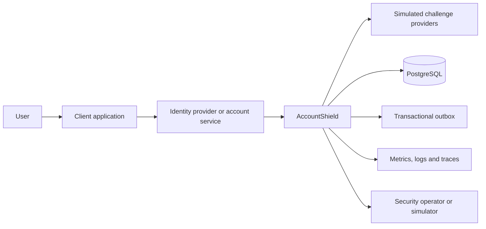
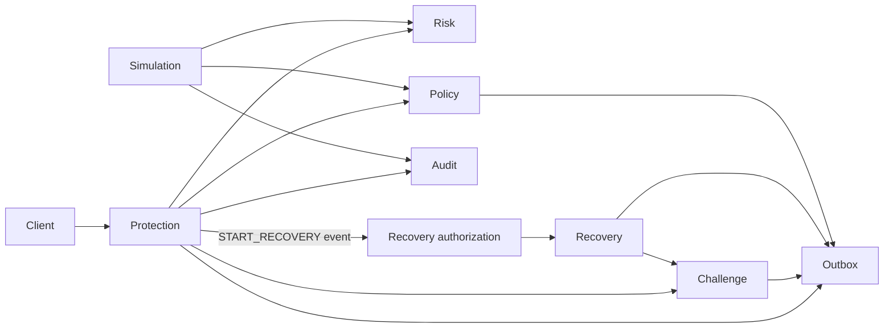

# Architecture baseline

- Current implementation status: [feature catalog](../features/README.md)
- Executable guarantees: [architecture invariants](invariants.md)
- Delivery order: [roadmap](../roadmap.md)

This page describes the architecture currently executable on `main`. Planned capabilities are recorded in the feature catalog and roadmap rather than presented as delivered behavior.

## System intent

AccountShield evaluates security-sensitive account events and coordinates the next protective action. It is designed to demonstrate secure backend engineering, not to serve as a production identity provider or fraud engine.

The platform must make deterministic, versioned, explainable decisions while remaining safe under retries, duplicate requests, concurrent operations, delayed external responses, and policy evolution.

## Context



AccountShield does not receive or persist passwords. Account identifiers are opaque references supplied by the caller. External challenge providers are simulated until a dedicated integration milestone.

## Initial modules

### `protection`

Owns the inbound protection use case and the final decision contract. It may orchestrate risk and policy evaluation, but it must not calculate individual signal scores or mutate audit history directly.

### `risk`

Owns normalized signals, risk contributions, score calculation, and risk-level classification. The same normalized input and algorithm version must produce the same assessment.

### `policy`

Owns versioned rules that convert a risk assessment and account context into a protection decision. Policies must be immutable after activation; corrections create a new version.

### `audit`

Owns the append-only decision trace. Audit records preserve the request fingerprint, normalized inputs allowed for retention, algorithm version, policy version, contributions, final outcome, timestamps, and correlation identifiers.

Future modules such as `abuse` may be introduced only with a vertical slice that exercises them. The `outbox` module is already part of the system and owns the transactional outbox pattern with a relay (see ADR 0009).

### `challenge`

Owns the step-up challenge lifecycle: creation, verification attempts, expiration, retry budget, and terminal states. Challenge providers are simulated (TOTP, e-mail, WebAuthn). See ADR 0004.

### `recovery`

Owns explicit recovery-authorization persistence and consumption, the secure recovery state machine, risk-based classification, identity-challenge coordination, delayed eligibility, and manual review. A `START_RECOVERY` decision emits an immutable, expirable authorization; recovery never uses audit as execution authority. See [recovery architecture](recovery.md), ADR 0005, and ADR 0010.

### `simulation`

Owns deterministic replay of historical decisions and shadow-policy evaluation against candidate policy versions. Both operations are side-effect-free. See ADR 0006.

## Module interaction and dependency direction

Runtime flow and source-code dependency are documented separately. An event can flow from a publisher to a consumer while the consumer depends on the publisher-owned public event contract.

### Main runtime flow



### Current public module dependencies

```text
protection -> risk public API
protection -> policy public API
protection -> audit public API
protection -> challenge public API
policy     -> risk public API
recovery   -> challenge public API
recovery   -> protection public RecoveryAuthorizationIssued event
simulation -> audit public API
simulation -> policy public API
simulation -> risk public API
outbox     -> public domain events from producing modules
```

There is deliberately no `recovery -> audit` operational dependency. Recovery stores audit identifiers as correlation evidence but authorizes initiation only through its own persisted `RecoveryAuthorization`.

Modules must not depend on web adapters outside their own package. Infrastructure implementations remain internal to the module that owns the port. Cross-module access occurs through public module APIs or domain events; repositories and persistence entities are never shared.

## Core invariants

1. Every accepted protection request has a caller-supplied idempotency key or a deterministic request fingerprint.
2. A repeated request cannot create a second logical decision.
3. Every decision records the exact risk-algorithm and policy versions used.
4. Historical decision records are append-only and cannot be rewritten by policy deployment.
5. A reason contribution is part of the decision model, not reconstructed from logs.
6. Risk scores are bounded and cannot overflow their defined range.
7. A challenge or recovery action cannot be started from an outcome that did not authorize it.
8. Sensitive raw signals are minimized; derived values are preferred where possible.
9. Replay never executes external side effects.
10. Shadow-policy evaluation cannot change the live user outcome.
11. Audit evidence cannot act as the operational recovery credential.
12. A recovery authorization is immutable, expires, and can create at most one recovery flow.
13. Recovery classification gates remain enforced after successful identity verification.
14. Internal repositories and persistence entities never cross module boundaries.

## Trust boundaries

### Untrusted caller input

All request fields, headers, device claims, network data, and timestamps supplied by clients are untrusted. Validation checks shape and bounds but does not make a claim truthful.

### Trusted internal configuration

Activated policy definitions and algorithm versions are trusted only after validation and controlled publication. Configuration changes require audit records.

### External provider responses

Challenge-provider responses are authenticated and correlated, but remain fallible. Timeouts and ambiguous outcomes must not be treated as definitive failures or successes without recovery logic.

### Operator and simulation APIs

Administrative and simulation operations are separate from the public decision API. They must never expose raw secrets or allow a replay to trigger live external effects.

## Threat model baseline

| Threat | Initial control direction |
| --- | --- |
| Credential stuffing | velocity signals, account/IP throttling, temporary blocks |
| Password spraying | cross-account aggregation and IP/device controls |
| Account takeover | new-device, impossible-travel, session and recent-change signals |
| Recovery abuse | recovery-specific risk policy, cooldowns, delayed operations |
| MFA fatigue | challenge attempt budgets and explicit user confirmation simulation |
| Replay attack | idempotency keys, nonce/fingerprint storage, bounded validity windows |
| Enumeration | uniform public responses and protected operational detail |
| Policy tampering | immutable versions, validation, controlled activation and audit |
| Audit manipulation | append-only model, database constraints and restricted write path |
| Sensitive-data leakage | minimization, redaction, structured logging rules and retention limits |
| Denial of service | bounded payloads, rate limits, timeouts and bulkheads |
| Insider misuse | least privilege, immutable operator audit and separated admin APIs |

## Data classification

- **Public:** documentation, policy examples without customer data, simulator scenarios.
- **Internal:** policy identifiers, algorithm versions, aggregated metrics.
- **Sensitive:** opaque account identifiers, IP-derived attributes, device fingerprints, decision traces.
- **Forbidden:** passwords, raw authentication secrets, production MFA seeds, private keys, full payment data.

Logs must not contain forbidden data. Sensitive values require explicit structured fields and redaction rules.

### Per-table classification and retention

| Schema.table | Classification | Retention | Mechanism |
| --- | --- | --- | --- |
| `protection.protection_request` | Sensitive (account reference) | No automated purge yet | Source-of-truth decision input; deletion policy tracked with future protection-module retention work |
| `protection.idempotency_record` | Internal (request fingerprints) | Bounded by `expires_at`, cleanup not yet automated | Tracked separately under issue #22 |
| `policy.policy_version` | Internal (no account data) | Retained indefinitely | Immutable policy history is intentionally kept for audit and rollback |
| `audit.decision_trace` / `audit.decision_reason` | Sensitive (decision evidence) | Retained indefinitely | Append-only compliance evidence; no automated deletion by design |
| `challenge.challenge_plan` | Sensitive (account reference); code is hashed, never stored raw | Terminal rows (VERIFIED/CONSUMED/FAILED/EXPIRED) purged after `accountshield.challenge.retention.terminal-ttl` (default 1 day) past expiry | `ChallengePlanRetentionCleanup` (`challenge/internal`), mirrors the recovery-flow job below |
| `recovery.recovery_flow` | Sensitive (account reference, risk data) | Terminal rows purged after `accountshield.recovery.retention.terminal-ttl` (default 30 days) | `RecoveryFlowRetentionCleanup` (`recovery/internal`), added in issue #18 |
| `recovery.recovery_authorization` | Sensitive (account reference) | No automated purge yet | Deletion policy tracked with future recovery-module retention work |
| `outbox.outbox_event` | Sensitive prior to pseudonymization, Internal after | Retained as the append-only integration log | Not purged here — a distinct concern from the future outbox-relay/archival design |

### Pseudonymization

Domain events stay in-process only and are never logged with raw account identifiers (verified: `SecurityEventLogger` logs no `accountReference` field). The one place a full event payload leaves the in-process boundary is the outbox (`outbox.outbox_event.payload`), which is the actual "integration event" surface per the outbox-relay design.

`AccountPseudonymizer` (`outbox/internal`) computes a deterministic, keyed HMAC-SHA256 pseudonym (`accountshield.privacy.pseudonym-secret`) from a raw account reference. `OutboxEventRecorder` substitutes this `subjectToken` for the raw `accountReference` before persisting the payload for `ProtectionDecisionMade`, `ChallengeCompleted`, and `RecoveryCompleted` (the three outbox-recorded event types that carry an account reference). The same account always maps to the same token, so downstream consumers can still correlate events for one subject without the outbox ever storing the raw identifier.

## Persistence direction

PostgreSQL is the source of truth for decisions, policy versions, recovery state, idempotency records, and the transactional outbox. Ephemeral controls such as rate-limit counters use in-process storage; ADR 0008 documents this choice and the conditions under which a distributed store may be introduced.

## Testing strategy

- unit tests for score and policy boundaries;
- property-based tests for score bounds and determinism;
- Spring Modulith verification for package dependencies;
- module integration tests for public contracts;
- Testcontainers for PostgreSQL behavior;
- concurrency tests for idempotency and state transitions;
- replay fixtures for historical determinism;
- architecture tests preventing adapters from leaking into the domain.

## Evolution rule

A module may be considered for extraction only when there is evidence of an independent scaling, ownership, deployment, data-governance, or failure-isolation requirement. Network distribution is not considered an architectural improvement by itself.
