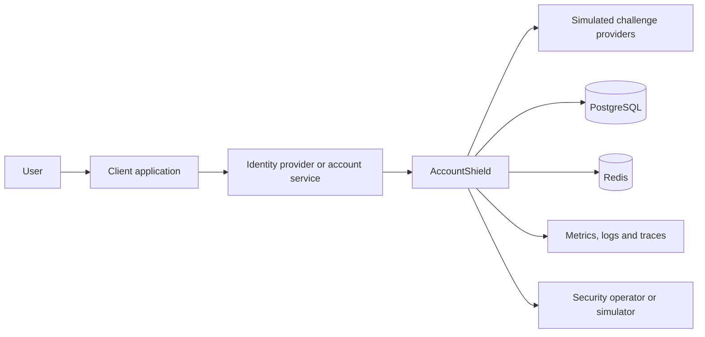

# Architecture baseline

## System intent

AccountShield evaluates security-sensitive account events and coordinates the next protective action. It is designed to demonstrate secure backend engineering, not to serve as a production identity provider or fraud engine.

The platform must make deterministic, versioned, explainable decisions while remaining safe under retries, duplicate requests, concurrent operations, delayed external responses, and policy evolution.

## Context



AccountShield does not receive or persist passwords. Account identifiers are opaque references supplied by the caller. External challenge providers are simulated until a dedicated integration milestone.

## Initial modules

### `protection`

Owns the inbound protection use case and the final decision contract. It may orchestrate risk and policy evaluation, but it must not calculate individual signal scores or mutate audit history directly.

### `risk`

Owns normalized signals, risk contributions, score calculation, and risk-level classification. The same normalized input and algorithm version must produce the same assessment.

### `policy`

Owns versioned rules that convert a risk assessment and account context into a protection decision. Policies must be immutable after activation; corrections create a new version.

### `audit`

Owns the append-only decision trace. Audit records preserve the request fingerprint, normalized inputs allowed for retention, algorithm version, policy version, contributions, final outcome, timestamps, and correlation identifiers.

Future modules such as `challenge`, `recovery`, `abuse`, `simulation`, and `outbox` will be introduced only with a vertical slice that exercises them.

## Dependency direction

The intended direction is:

```text
protection -> risk
protection -> policy
protection -> audit
policy     -> risk public API
```

The `risk`, `policy`, and `audit` modules must not depend on web adapters. Infrastructure implementations remain internal to the module that owns the port.

Cross-module access must occur through public module APIs or domain events. Repositories and internal persistence entities are never shared between modules.

## Core invariants

1. Every accepted protection request has a caller-supplied idempotency key or a deterministic request fingerprint.
2. A repeated request cannot create a second logical decision.
3. Every decision records the exact risk-algorithm and policy versions used.
4. Historical decision records are append-only and cannot be rewritten by policy deployment.
5. A reason contribution is part of the decision model, not reconstructed from logs.
6. Risk scores are bounded and cannot overflow their defined range.
7. A challenge or recovery action cannot be started from an outcome that did not authorize it.
8. Sensitive raw signals are minimized; derived values are preferred where possible.
9. Replay never executes external side effects.
10. Shadow-policy evaluation cannot change the live user outcome.

## Trust boundaries

### Untrusted caller input

All request fields, headers, device claims, network data, and timestamps supplied by clients are untrusted. Validation checks shape and bounds but does not make a claim truthful.

### Trusted internal configuration

Activated policy definitions and algorithm versions are trusted only after validation and controlled publication. Configuration changes require audit records.

### External provider responses

Challenge-provider responses are authenticated and correlated, but remain fallible. Timeouts and ambiguous outcomes must not be treated as definitive failures or successes without recovery logic.

### Operator and simulation APIs

Administrative and simulation operations are separate from the public decision API. They must never expose raw secrets or allow a replay to trigger live external effects.

## Threat model baseline

| Threat | Initial control direction |
| --- | --- |
| Credential stuffing | velocity signals, account/IP throttling, temporary blocks |
| Password spraying | cross-account aggregation and IP/device controls |
| Account takeover | new-device, impossible-travel, session and recent-change signals |
| Recovery abuse | recovery-specific risk policy, cooldowns, delayed operations |
| MFA fatigue | challenge attempt budgets and explicit user confirmation simulation |
| Replay attack | idempotency keys, nonce/fingerprint storage, bounded validity windows |
| Enumeration | uniform public responses and protected operational detail |
| Policy tampering | immutable versions, validation, controlled activation and audit |
| Audit manipulation | append-only model, database constraints and restricted write path |
| Sensitive-data leakage | minimization, redaction, structured logging rules and retention limits |
| Denial of service | bounded payloads, rate limits, timeouts and bulkheads |
| Insider misuse | least privilege, immutable operator audit and separated admin APIs |

## Data classification

- **Public:** documentation, policy examples without customer data, simulator scenarios.
- **Internal:** policy identifiers, algorithm versions, aggregated metrics.
- **Sensitive:** opaque account identifiers, IP-derived attributes, device fingerprints, decision traces.
- **Forbidden:** passwords, raw authentication secrets, production MFA seeds, private keys, full payment data.

Logs must not contain forbidden data. Sensitive values require explicit structured fields and redaction rules.

## Persistence direction

PostgreSQL will become the source of truth for decisions, policy versions, recovery state, idempotency records, and the transactional outbox. Redis is limited to reconstructible ephemeral controls such as rate-limit counters, short-lived cooldowns, and caches.

Correctness must not depend on Redis retaining data indefinitely.

## Testing strategy

- unit tests for score and policy boundaries;
- property-based tests for score bounds and determinism;
- Spring Modulith verification for package dependencies;
- module integration tests for public contracts;
- Testcontainers for PostgreSQL and Redis behavior;
- concurrency tests for idempotency and state transitions;
- replay fixtures for historical determinism;
- architecture tests preventing adapters from leaking into the domain.

## Evolution rule

A module may be considered for extraction only when there is evidence of an independent scaling, ownership, deployment, data-governance, or failure-isolation requirement. Network distribution is not considered an architectural improvement by itself.
