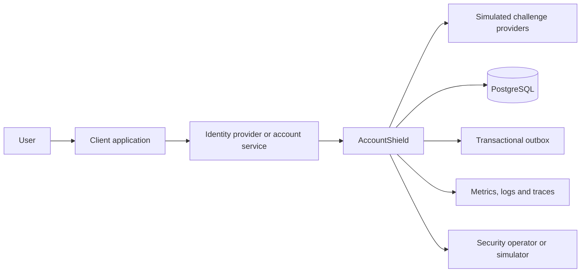
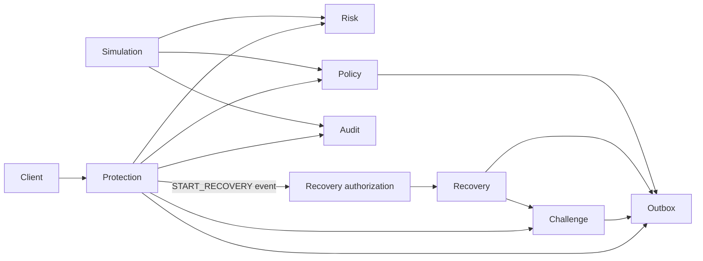

# Architecture baseline

- Current implementation status: [feature catalog](../features/README.md)
- Executable guarantees: [architecture invariants](invariants.md)
- Delivery order: [roadmap](../roadmap.md)

This page describes the architecture currently executable on `main`. Planned capabilities are recorded in the feature catalog and roadmap rather than presented as delivered behavior.

## System intent

AccountShield evaluates security-sensitive account events and coordinates the next protective action. It is designed to demonstrate secure backend engineering, not to serve as a production identity provider or fraud engine.

The platform must make deterministic, versioned, explainable decisions while remaining safe under retries, duplicate requests, concurrent operations, delayed external responses, and policy evolution.

## Context


```mermaid
flowchart LR
    User[User] --> Client[Client application]
    Client --> IdP[Identity provider or account service]
    IdP --> Shield[AccountShield]
    Shield --> Challenge[Simulated challenge providers]
    Shield --> Store[(PostgreSQL)]
    Shield --> Outbox[Transactional outbox]
    Shield --> Observability[Metrics, logs and traces]
    Shield --> Operator[Security operator or simulator]
```

AccountShield does not receive or persist passwords. Account identifiers are opaque references supplied by the caller. External challenge providers are simulated until a dedicated integration milestone.

## Initial modules

### `protection`

Owns the inbound protection use case and the final decision contract. It may orchestrate risk and policy evaluation, but it must not calculate individual signal scores or mutate audit history directly. Every request carries an opaque `ClientId` (defaulting to a single-tenant `default-client` when omitted, ADR 0017) that scopes idempotency keys and rate limits per client and is passed to `policy.PolicyRoutingService` to resolve which policy key a given client/event combination should be evaluated against.

### `risk`

Owns normalized signals, risk contributions, score calculation, and risk-level classification. The same normalized input and algorithm version must produce the same assessment.

### `policy`

Owns versioned rules that convert a risk assessment and account context into a protection decision. Policies must be immutable after activation; corrections create a new version. The `DRAFT → VALIDATED` transition runs a deterministic static analyzer (`PolicyAnalyzer`, ADR 0015) over the candidate's thresholds; a version with a missing, out-of-range, or shadowed threshold is rejected there rather than failing unpredictably at evaluation time, and the analysis is persisted alongside the version once it passes. A further `VALIDATED → APPROVED` gate (ADR 0016) requires a step-up-authenticated actor other than the version's author to approve it with a recorded reason before `activate()` will accept it; self-approval is rejected structurally, not just by convention. `PolicyRoutingService` (ADR 0017) resolves which `policy_key` a client/event-type combination should be evaluated against via a seeded `client_policy_route` table; because `uq_single_active_policy` is already scoped per `policy_key`, giving different clients different policy keys isolates their activation lifecycles without any change to the entity or its migrations.

### `audit`

Owns the append-only decision trace. Audit records preserve the request fingerprint, normalized inputs allowed for retention, algorithm version, policy version, contributions, final outcome, timestamps, and correlation identifiers. Beyond the append-only database trigger, every row is also chained by content hash (`chain_sequence`/`previous_hash`/`record_hash`), so tampering that bypasses the trigger itself is independently detectable; see [tamper-evident hash chaining](#tamper-evident-hash-chaining) below and ADR 0027.

Future modules such as `abuse` may be introduced only with a vertical slice that exercises them. The `outbox` module is already part of the system and owns the transactional outbox pattern with a relay (see ADR 0009). The `webhook` module owns signed external delivery: it provides the outbox's real `OutboxEventPublisher` implementation, subscription/secret management, and an in-process demo receiver (ADR 0026).

### `challenge`

Owns the step-up challenge lifecycle: creation, verification attempts, expiration, retry budget, and terminal states. Challenge providers are simulated (TOTP, e-mail, WebAuthn). See ADR 0004.

### `recovery`

Owns explicit recovery-authorization persistence and consumption, the secure recovery state machine, risk-based classification, identity-challenge coordination, delayed eligibility, and manual review. A `START_RECOVERY` decision emits an immutable, expirable authorization; recovery never uses audit as execution authority. See [recovery architecture](recovery.md), ADR 0005, and ADR 0010.

### `simulation`

Owns deterministic replay of historical decisions and shadow-policy evaluation against candidate policy versions. Both operations are side-effect-free. See ADR 0006. Replay re-runs the recorded risk algorithm (not just the recorded score) via a versioned `risk.RiskAlgorithmRegistry`, reconstructing the historical signal envelope from the persisted decision trace (ADR 0019).

## Module interaction and dependency direction

Runtime flow and source-code dependency are documented separately. An event can flow from a publisher to a consumer while the consumer depends on the publisher-owned public event contract.

### Main runtime flow


```mermaid
flowchart LR
    Client --> Protection
    Protection --> Risk
    Protection --> Policy
    Protection --> Audit
    Protection --> Challenge
    Protection -- START_RECOVERY event --> RecoveryAuth[Recovery authorization]
    RecoveryAuth --> Recovery
    Recovery --> Challenge
    Protection --> Outbox
    Challenge --> Outbox
    Recovery --> Outbox
    Policy --> Outbox
    Simulation --> Audit
    Simulation --> Policy
    Simulation --> Risk
```

### Current public module dependencies

```text
protection -> risk public API
protection -> policy public API
protection -> audit public API
protection -> challenge public API
policy     -> risk public API
recovery   -> challenge public API
recovery   -> protection public RecoveryAuthorizationIssued event
simulation -> audit public API
simulation -> policy public API
simulation -> risk public API
outbox     -> public domain events from producing modules
```

There is deliberately no `recovery -> audit` operational dependency. Recovery stores audit identifiers as correlation evidence but authorizes initiation only through its own persisted `RecoveryAuthorization`.

Modules must not depend on web adapters outside their own package. Infrastructure implementations remain internal to the module that owns the port. Cross-module access occurs through public module APIs or domain events; repositories and persistence entities are never shared.

## Core invariants

1. Every accepted protection request has a caller-supplied idempotency key or a deterministic request fingerprint.
2. A repeated request cannot create a second logical decision.
3. Every decision records the exact risk-algorithm and policy versions used.
4. Historical decision records are append-only and cannot be rewritten by policy deployment.
5. A reason contribution is part of the decision model, not reconstructed from logs.
6. Risk scores are bounded and cannot overflow their defined range.
7. A challenge or recovery action cannot be started from an outcome that did not authorize it.
8. Sensitive raw signals are minimized; derived values are preferred where possible.
9. Replay never executes external side effects.
10. Shadow-policy evaluation cannot change the live user outcome.
11. Audit evidence cannot act as the operational recovery credential.
12. A recovery authorization is immutable, expires, and can create at most one recovery flow.
13. Recovery classification gates remain enforced after successful identity verification.
14. Internal repositories and persistence entities never cross module boundaries.

## Trust boundaries

### Untrusted caller input

All request fields, headers, device claims, network data, and timestamps supplied by clients are untrusted. Validation checks shape and bounds but does not make a claim truthful.

### Trusted internal configuration

Activated policy definitions and algorithm versions are trusted only after validation and controlled publication. Configuration changes require audit records.

### External provider responses

Challenge-provider responses are authenticated and correlated, but remain fallible. Timeouts and ambiguous outcomes must not be treated as definitive failures or successes without recovery logic.

### Operator and simulation APIs

Administrative and simulation operations are separate from the public decision API. They must never expose raw secrets or allow a replay to trigger live external effects.

## Threat model baseline

| Threat | Initial control direction |
| --- | --- |
| Credential stuffing | velocity signals, account/IP throttling, temporary blocks |
| Password spraying | cross-account aggregation and IP/device controls |
| Account takeover | new-device, impossible-travel, session and recent-change signals |
| Recovery abuse | recovery-specific risk policy, cooldowns, delayed operations |
| MFA fatigue | challenge attempt budgets and explicit user confirmation simulation |
| Replay attack | idempotency keys, nonce/fingerprint storage, bounded validity windows |
| Enumeration | uniform public responses and protected operational detail |
| Policy tampering | immutable versions, validation, controlled activation and audit |
| Audit manipulation | append-only model, database constraints and restricted write path |
| Sensitive-data leakage | minimization, redaction, structured logging rules and retention limits |
| Denial of service | bounded payloads, rate limits, timeouts and bulkheads |
| Insider misuse | least privilege, immutable operator audit and separated admin APIs |

## Data classification

- **Public:** documentation, policy examples without customer data, simulator scenarios.
- **Internal:** policy identifiers, algorithm versions, aggregated metrics.
- **Sensitive:** opaque account identifiers, IP-derived attributes, device fingerprints, decision traces.
- **Forbidden:** passwords, raw authentication secrets, production MFA seeds, private keys, full payment data.

Logs must not contain forbidden data. Sensitive values require explicit structured fields and redaction rules.

### Per-table classification and retention

| Schema.table | Classification | Retention | Mechanism |
| --- | --- | --- | --- |
| `protection.protection_request` | Sensitive (account reference) | Retained indefinitely | Transitively pinned by `audit.decision_trace`'s FK to it (ADR 0024) — since decision traces are never deleted, purging their referenced protection requests would violate that FK; this is a deliberate consequence, not a missing purge job. `account_reference` is envelope-encrypted at rest (ADR 0025); the other four tables below still carry it in plaintext, deferred there |
| `protection.idempotency_record` | Internal (request fingerprints) | Bounded by `expires_at`; expired rows purged in bounded batches | `IdempotencyRecordRetentionCleanup` (`protection/internal`), ADR 0018 |
| `policy.policy_version` | Internal (no account data) | Retained indefinitely | Immutable policy history is intentionally kept for audit and rollback |
| `policy.client_policy_route` | Internal (client id + policy key, no account data) | Retained indefinitely | Simple client/event-to-policy-key mapping, not a governed lifecycle artifact |
| `audit.decision_trace` / `audit.decision_reason` | Sensitive (decision evidence) | Retained indefinitely | Append-only compliance evidence; no automated deletion by design. `decision_trace` rows written after ADR 0027 also carry a tamper-evident hash chain (`chain_sequence`/`previous_hash`/`record_hash`) |
| `audit.chain_verification_checkpoint` | Internal (a single sequence number, no account data) | Retained indefinitely; single-row table | Mutable operational bookkeeping for `AuditChainIntegrityCheckJob`, ADR 0027 |
| `challenge.challenge_plan` | Sensitive (account reference); code is hashed, never stored raw | Terminal rows (VERIFIED/CONSUMED/FAILED/EXPIRED) purged after `accountshield.challenge.retention.terminal-ttl` (default 1 day) past expiry | `ChallengePlanRetentionCleanup` (`challenge/internal`), mirrors the recovery-flow job below |
| `recovery.recovery_flow` | Sensitive (account reference, risk data) | Terminal rows purged after `accountshield.recovery.retention.terminal-ttl` (default 30 days) | `RecoveryFlowRetentionCleanup` (`recovery/internal`), added in issue #18 |
| `recovery.recovery_authorization` | Sensitive (account reference) | Purged after `accountshield.recovery.authorization-retention.expired-ttl` (default 30 days) past `expires_at`, consumed or not | `RecoveryAuthorizationRetentionCleanup` (`recovery/internal`), ADR 0024 |
| `outbox.outbox_event` | Sensitive prior to pseudonymization, Internal after | `PUBLISHED` rows purged after `accountshield.outbox.retention.published-ttl` (default 7 days); `DEAD_LETTERED` rows purged after `.dead-lettered-ttl` (default 30 days, longer for investigation) | `OutboxEventRetentionCleanup` (`outbox/internal`), ADR 0023 |
| `webhook.webhook_subscription` | Sensitive (subscription secret; encrypted at rest under a static app key, returned in plaintext only once at creation/rotation, never again) | Retained until an operator disables it; no automated purge | ADR 0026 |

### Database roles

Migrations run under a single owner-equivalent role today (see ADR 0024's explicit scoping note on why the running application's own connection has not been switched in this repository's local-dev `compose.yaml`). Two additional roles exist at the database level, created and granted by migration `V20`, ready for a deployment to use directly:

| Role | Purpose | Grants |
| --- | --- | --- |
| `accountshield_runtime` | The application's day-to-day DML | `SELECT`/`INSERT`/`UPDATE`/`DELETE` on regular tables; `SELECT`/`INSERT` only on `audit.decision_trace`/`audit.decision_reason` (no `UPDATE`/`DELETE` — enforced at the grant level in addition to the existing `reject_audit_mutation()` trigger) |
| `accountshield_readonly` | Future reporting/observability connections | `SELECT` only, everywhere |

Neither role owns, nor has any grant on, the three immutability trigger functions (`audit.reject_audit_mutation`, `policy.protect_activated_policy_version`, `recovery.protect_recovery_authorization`) or the triggers that call them — Postgres's default-deny model means a non-owner role with no explicit grant cannot alter or drop them.

`V21` (ADR 0025) extends these same grants to the new `crypto` schema (`crypto.subject_key`): `accountshield_runtime` gets `SELECT`/`INSERT`/`UPDATE` (rows are never physically deleted, so no `DELETE` grant is needed), `accountshield_readonly` gets `SELECT`.

### Pseudonymization

Domain events stay in-process only and are never logged with raw account identifiers (verified: `SecurityEventLogger` logs no `accountReference` field). The one place a full event payload leaves the in-process boundary is the outbox (`outbox.outbox_event.payload`), which is the actual "integration event" surface per the outbox-relay design.

`AccountPseudonymizer` (`outbox/internal`) computes a deterministic, keyed HMAC-SHA256 pseudonym (`accountshield.privacy.pseudonym-secret`) from a raw account reference. `OutboxEventRecorder` substitutes this `subjectToken` for the raw `accountReference` before persisting the payload for `ProtectionDecisionMade`, `ChallengeCompleted`, `RecoveryCompleted`, and `RecoveryManualReviewRequired` (the four outbox-recorded event types that carry an account reference; `PolicyActivated` does not). The same account always maps to the same token, so downstream consumers can still correlate events for one subject without the outbox ever storing the raw identifier.

### Envelope encryption and crypto-shredding

`protection.protection_request.account_reference` is encrypted at rest via the `crypto` module's `FieldEncryptionService` (ADR 0025): a random per-subject data-encryption key (DEK), wrapped by a versioned key-encryption key (KEK) held only in application config (`accountshield.crypto.*`), never in the database. `crypto.subject_key` holds one row per subject (a deterministic HMAC of the account reference, independent of `AccountPseudonymizer`'s pseudonym); destroying that row's key material (crypto-shredding) makes every value ever encrypted for that subject permanently irrecoverable without deleting the rows that reference it. `SubjectKeyRewrapJob` re-wraps subject keys onto a newly rotated active KEK version in bounded batches, exposing `accountshield.crypto.rewrap.pending` (gauge) and `accountshield.crypto.rewrap.count` (counter). This is deliberately scoped to `protection_request` only for now — `audit.decision_trace`, `challenge.challenge_plan`, `recovery.recovery_flow`, and `recovery.recovery_authorization` still carry `account_reference` in plaintext (see ADR 0025's Context/Scope for why).

### Tamper-evident hash chaining

Every `audit.decision_trace` row written since ADR 0027 carries `chain_sequence` (application-assigned, not a database `SERIAL`), `previous_hash`, `record_hash`, `hash_algorithm`, and `canonical_schema_version`. `JdbcDecisionTraceRecorder` computes each row's hash from its own content plus its `decision_reason` children and the previous row's hash, under a Postgres advisory transaction lock (`pg_advisory_xact_lock`) that serializes concurrent decisions into one unambiguous chain, using the same fixed-field-order `DataOutputStream`/SHA-256 canonical-hash pattern `protection.RequestFingerprint` established (ADR 0020). `audit.AuditChainVerificationService.verifyRange` recomputes and checks a bounded range; `AuditChainIntegrityCheckJob` advances a single-row checkpoint (`audit.chain_verification_checkpoint`) forward through history and does not advance past a detected break, publishing `AuditChainIntegrityFailed` (routed through the outbox to any webhook subscription, completing ADR 0026's deferred `audit.integrity.failed`) and exposing `accountshield.audit.chain.verified`/`accountshield.audit.chain.checkpoint` metrics. `GET /api/v1/audit/chain/verify` and `/root-hash` (`SECURITY_OPERATOR`) provide on-demand verification and the current chain tip. This detects tampering that bypasses the append-only trigger; it does not defend against a sustained, privileged attacker who also recomputes downstream hashes -- see ADR 0027's Limitations section.

### Webhook delivery

`webhook.WebhookEventPublisher` is the outbox's real `OutboxEventPublisher` (ADR 0026), auto-registered in place of the log-only default. For each outbox message it delivers to every `ACTIVE` `webhook.webhook_subscription` whose `eventTypeFilter` is null or matches the event type, signing `timestamp.deliveryId.rawBody` with HMAC-SHA256 under that subscription's own secret and sending `X-Webhook-Signature`/`X-Webhook-Timestamp`/`X-Webhook-Delivery-Id`/`X-Webhook-Schema-Version` headers. A failed delivery makes `publish()` throw, so the existing outbox retry/backoff/dead-letter loop (ADR 0023) drives retries unmodified; `outbox_event.id` is already the stable delivery ID across retries. Subscription secrets are encrypted at rest under a single static app key (`WebhookSecretCipher`, `accountshield.webhook.secret-encryption-key`) and returned in plaintext exactly once, at creation and at each rotation (`POST /api/v1/webhooks`, `POST /api/v1/webhooks/{id}/rotate-secret`) — no read path ever returns it again. `/demo/webhook-receiver` is an in-process reference receiver verifying the same signature and rejecting stale timestamps and duplicate delivery IDs, proving the contract end to end without a second deployable.

## Persistence direction

PostgreSQL is the source of truth for decisions, policy versions, recovery state, idempotency records, and the transactional outbox. Ephemeral controls such as rate-limit counters use in-process storage; ADR 0008 documents this choice and the conditions under which a distributed store may be introduced.

## Testing strategy

- unit tests for score and policy boundaries;
- property-based tests for score bounds and determinism;
- Spring Modulith verification for package dependencies;
- module integration tests for public contracts;
- Testcontainers for PostgreSQL behavior;
- concurrency tests for idempotency and state transitions;
- replay fixtures for historical determinism;
- architecture tests preventing adapters from leaking into the domain.

## Evolution rule

A module may be considered for extraction only when there is evidence of an independent scaling, ownership, deployment, data-governance, or failure-isolation requirement. Network distribution is not considered an architectural improvement by itself.
