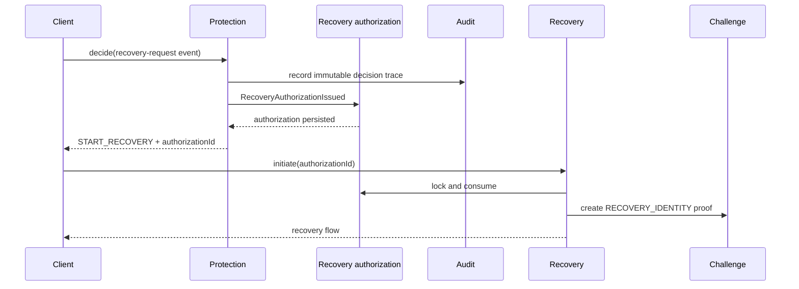
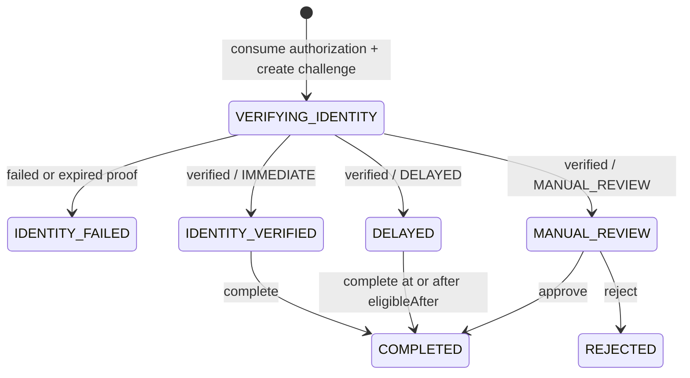

# Recovery architecture

## Responsibility

The `recovery` module owns recovery authorization persistence and consumption, recovery state, classification, eligibility timing, identity-challenge orchestration, completion, and manual-review transitions.

The module does not use audit as an operational authorization source and does not own challenge verification algorithms. It receives a synchronous authorization-issued event from protection and interacts with the `challenge` module through public commands.

## Authorization lifecycle

A protection decision with outcome `START_RECOVERY` creates a `RecoveryAuthorization` in the same transaction. The decision response returns `recoveryAuthorizationId`, which is the only credential accepted by recovery initiation.



An authorization contains:

- authorization ID;
- protection request and decision IDs for correlation;
- opaque account reference;
- recovery directive;
- risk score;
- issue, expiry, and consumption timestamps.

It expires after 15 minutes. All fields except the first assignment of `consumedAt` are immutable. PostgreSQL protects this invariant with constraints and a trigger.

Equivalent retries with an authorization that already created a flow return that same flow. They do not consume again or create a second challenge.

## Flow



## Classification gates

The risk score is copied from the authorization and classification is persisted during initiation. Classification is the sole input used to select the state after identity confirmation.

| Score | Classification | Required gate |
| ---: | --- | --- |
| 0–30 | `IMMEDIATE` | verified identity |
| 31–60 | `DELAYED` | verified identity plus elapsed `eligibleAfter` |
| 61–100 | `MANUAL_REVIEW` | verified identity plus approved review |

A verified identity does not normalize every flow into a completion-ready state:

```text
IMMEDIATE      -> IDENTITY_VERIFIED
DELAYED        -> DELAYED
MANUAL_REVIEW  -> MANUAL_REVIEW
```

## Challenge interaction

Initiation creates a challenge using:

```text
purpose   = RECOVERY_IDENTITY
contextId = recoveryId
subject   = opaque account reference from the authorization
```

`confirmIdentity` consumes the challenge with the same purpose, context, and account binding. Only the exact challenge created for the recovery may be consumed, and successful consumption is single-use.

## Completion rules

- `IDENTITY_VERIFIED` may transition to `COMPLETED`.
- `DELAYED` may transition to `COMPLETED` only when the injected UTC clock is not before `eligibleAfter`.
- `MANUAL_REVIEW` is rejected by the public completion operation.
- `MANUAL_REVIEW` reaches `COMPLETED` only through approval.
- `MANUAL_REVIEW` reaches `REJECTED` through rejection.
- terminal states cannot be reopened.
- equivalent completion retries on `COMPLETED` return the existing result.

## Persistence and trust boundary

PostgreSQL is the source of truth for both `recovery_authorization` and `recovery_flow`.

The flow stores distinct identifiers for:

- `authorizationId`: operational credential consumed by the flow;
- `protectionRequestId`: originating protection operation;
- `originatingDecisionId`: evidence correlation.

A unique foreign key binds one flow to one authorization. The flow no longer has an operational foreign key to `audit.decision_trace`. Audit may be unavailable or lagging without invalidating an already persisted, unexpired authorization.

The recovery module never reads audit or challenge persistence directly.

## Tests

`RecoveryIntegrationTest` exercises:

```text
protection decision
  -> transactional authorization issuance
  -> authorization consumption
  -> purpose-bound challenge
  -> classification gate
  -> completion or review
```

The suite also proves:

- authorization works without an audit projection row;
- missing and expired identifiers fail identically;
- equivalent initiation returns one flow and one challenge;
- authorization fields cannot be mutated;
- boundary scores `30`, `31`, `60`, and `61` preserve their gates.

## Deferred hardening

The following concerns remain separate:

- recovery row versioning and broader initiation idempotency controls;
- authenticated operator identity and RBAC;
- authorization retention and cleanup;
- policy-specific authorization TTL;
- automated delayed-flow scheduling;
- recovery cooldown and notification providers.

See ADR 0005 for the state machine and ADR 0010 for authorization and trust boundaries.
