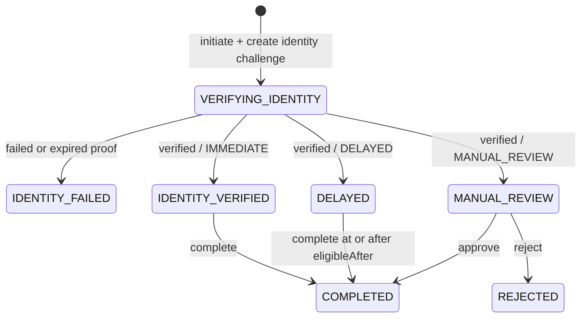

# Recovery architecture

## Responsibility

The `recovery` module coordinates account recovery after an originating protection decision has been recorded. It owns recovery state, classification, eligibility timing, identity-challenge orchestration, completion, and manual-review transitions.

The module does not own challenge verification algorithms. It interacts with the `challenge` module through public commands and consumes a purpose-bound challenge before advancing recovery state.

## Flow



## Classification gates

Classification is persisted during initiation and is the sole input used to select the state after identity confirmation.

| Score | Classification | Required gate |
| ---: | --- | --- |
| 0–30 | `IMMEDIATE` | verified identity |
| 31–60 | `DELAYED` | verified identity plus elapsed `eligibleAfter` |
| 61–100 | `MANUAL_REVIEW` | verified identity plus approved review |

A verified identity does not normalize every flow into a completion-ready state. This is a security invariant:

```text
IMMEDIATE      -> IDENTITY_VERIFIED
DELAYED        -> DELAYED
MANUAL_REVIEW  -> MANUAL_REVIEW
```

## Challenge interaction

Initiation creates a challenge using:

```text
purpose   = RECOVERY_IDENTITY
contextId = recoveryId
subject   = opaque account reference
```

The proof is verified through `ChallengeService.verify`. `confirmIdentity` then calls `ChallengeService.consume` with the same purpose, context, and account binding. Only the exact challenge created for the recovery may be consumed, and successful consumption is single-use.

## Completion rules

- `IDENTITY_VERIFIED` may transition to `COMPLETED`.
- `DELAYED` may transition to `COMPLETED` only when the injected UTC clock is not before `eligibleAfter`.
- `MANUAL_REVIEW` is always rejected by the public completion operation.
- `MANUAL_REVIEW` reaches `COMPLETED` only through approval.
- `MANUAL_REVIEW` reaches `REJECTED` through rejection.
- `COMPLETED`, `REJECTED`, and `IDENTITY_FAILED` cannot be reopened.
- equivalent completion retries on `COMPLETED` return the existing result.

## Persistence

PostgreSQL is the source of truth. The recovery row stores the originating protection request, account reference, event type, risk score, classification, challenge ID, status, timestamps, eligibility instant, and reviewer.

All externally visible state is reconstructed from the persisted row. The recovery module never reads challenge persistence directly.

## Tests

`RecoveryIntegrationTest` exercises the complete flow with PostgreSQL and the real challenge service:

```text
record decision trace
  -> initiate recovery
  -> verify bound challenge
  -> confirm identity and consume challenge
  -> complete or review
```

The suite fixes the classification boundaries at scores `30`, `31`, `60`, and `61`, checks completion before and after eligibility, covers approval and rejection, and verifies that terminal states cannot be reopened.

## Deferred hardening

The following concerns are intentionally separate:

- explicit recovery authorization instead of using the audit read model;
- idempotent initiation and recovery optimistic locking;
- authenticated operator identity and RBAC;
- versioned classification rules;
- automated delayed-flow scheduling;
- recovery cooldown and notification providers.

See ADR 0005 for the state-machine decision and ADR 0010 for recovery trust boundaries.
