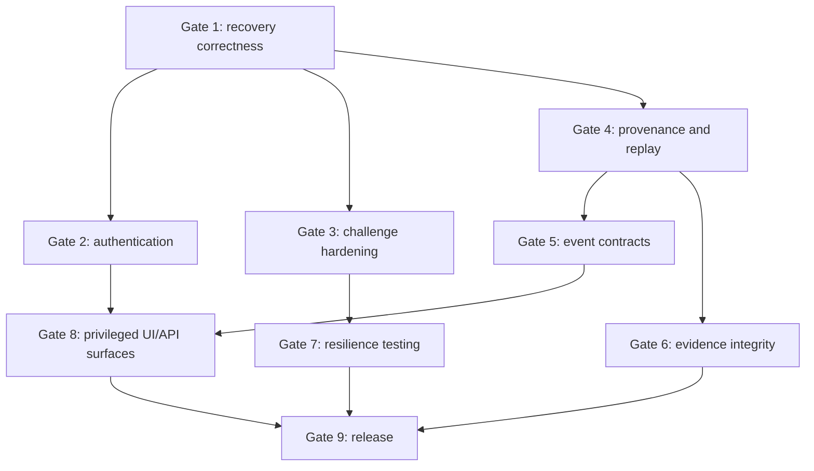

# AccountShield delivery roadmap

- Updated: 2026-07-24
- Execution tracker: GitHub issues
- Portfolio release target: defensible AccountShield 1.0

This roadmap defines dependency order and delivery gates. It does not replace GitHub issues; it explains which work must precede other work and which streams may proceed in parallel.

## Priority rules

1. Preserve executable security invariants before adding presentation features.
2. Resolve race conditions at the database/locking boundary, not only through pre-checks.
3. Establish authentication before enabling privileged UI mutations.
4. Freeze historical provenance before building advanced analysis and evidence exports.
5. Stabilize integration-event contracts before releasing SDKs, webhooks, or external consumers.
6. Add operational claims only after executable tests or measured evidence exist.
7. Update the feature catalog, architecture page, invariants, ADRs, and parent Epic in the same PR that changes status.

## Completed foundation

The following foundational gaps are closed on `main`:

- **#16:** recovery classification gates enforced end to end;
- **#17:** recovery authorized only from explicit `START_RECOVERY` decisions;
- **#30:** explicit immutable, expirable, single-use `RecoveryAuthorization`; audit removed as operational authority.

These form the baseline for all remaining recovery and authorization work.

## Gate 1 — Recovery concurrency and persistence correctness

### Primary sequence

1. **#18 — Recovery initiation idempotency and persistence hardening**
   - prove concurrent initiation with Testcontainers threads;
   - ensure one flow and one challenge;
   - define stable equivalent retry and conflicting reuse responses;
   - add terminal-flow retention semantics.
2. **#37 — PostgreSQL constraints and optimistic locking**
   - add `@Version` to recovery and challenge;
   - add missing score, attempts, state, and timestamp constraints;
   - map stale writes and constraint violations to stable domain conflicts.
3. **#31 — Version recovery classification provenance**
   - freeze classification rule/version in authorization and flow;
   - guarantee historical behavior after threshold evolution.
4. **#36 — Standardize Problem Details**
   - define stable codes for recovery conflict, stale write, invalid authorization, and state transition failures.

### Gate exit criteria

- concurrent recovery initiation has exactly one logical winner;
- equivalent retries return one flow;
- stale recovery/challenge writes cannot silently overwrite state;
- database errors do not leak through HTTP;
- recovery rule provenance is immutable and replayable.

## Gate 2 — Authentication and privileged authorization

### Primary sequence

1. **#19 — Authentication and RBAC for sensitive APIs**
   - establish JWT/local adapter and roles;
   - derive reviewer identity from principal;
   - protect policy, recovery review, simulation, metrics, and docs.
2. **#48 — Fresh purpose-bound step-up for privileged operations**
   - bind authorization to actor, purpose, and resource;
   - enforce freshness and single consumption.
3. **#33 — Maker-checker policy approval**
   - separate author, validator, and approver;
   - prevent self-approval and unapproved activation.

### Parallel work

- API problem-code completion from #36;
- operator audit fields required by #33 and #48.

### Gate exit criteria

- anonymous and wrong-role callers cannot invoke sensitive operations;
- manual recovery reviewer is server-derived;
- policy activation has separation of duties;
- privileged actions require recent purpose-bound proof.

## Gate 3 — Challenge secrecy and provider boundaries

### Primary sequence

1. **#20 — Challenge secrecy, provider behavior, and concurrent verification**
   - `SecureRandom` for simulation;
   - hash/HMAC stored proof material;
   - constant-time comparison where applicable;
   - distinct TOTP/email/WebAuthn contracts;
   - one terminal event under concurrency.
2. **#38 — Block simulated providers outside local/test**
   - fail startup for unsafe profile/configuration combinations;
   - expose safe provider mode in health/info.

### Dependency

This gate should consume optimistic-locking and conflict-mapping patterns established in Gate 1.

### Gate exit criteria

- raw verification codes are not persisted or logged;
- concurrent verification has one controlled winner;
- simulated WebAuthn is not represented as a six-digit code;
- production-like profiles cannot enable simulated providers.

## Gate 4 — Complete provenance, replay, and policy intelligence

### Primary sequence

1. **#45 — Risk signal provenance, freshness, and confidence**
2. **#21 + #43 — Full deterministic replay and provenance registry**
3. **#46 — Static policy analyzer/linter**
4. **#35 — Historical policy impact reports**
5. **#34 — Deterministic canary rollout and rollback**

### Why this order

- replay needs stable historical signal and algorithm provenance;
- impact analysis needs trustworthy replay and policy diagnostics;
- canary rollout should not deploy candidates before analyzer and impact gates exist.

### Gate exit criteria

- historical decisions reproduce score, reasons, outcome, directive, and versions;
- unavailable historical versions fail explicitly;
- unsafe policy definitions are blocked before activation;
- rollout decisions are deterministic, observable, and reversible.

## Gate 5 — Idempotency and integration-event reliability

### Primary sequence

1. **#22 — Concurrent protection idempotency**
2. **#23 — Outbox claiming, backoff, and dead letters**
3. **#47 — Signed webhook delivery with replay protection**
4. **#52 — OpenAPI and AsyncAPI compatibility gates**

### Why this order

- stable logical request identity precedes reliable event publication;
- outbox external schemas precede webhooks and AsyncAPI baselines;
- compatibility gates should freeze contracts after semantics are correct.

### Gate exit criteria

- concurrent equivalent decisions return one result;
- multi-instance relay does not publish concurrently under normal operation;
- poison events become visible dead letters;
- webhook consumers verify signatures and reject replays;
- CI detects incompatible API/event changes.

## Gate 6 — Data protection, database governance, and evidence integrity

### Primary sequence

1. **#32 — Data classification, pseudonymization, and retention model**
2. **#25 — Database least privilege and retention execution**
3. **#49 — Encryption rotation and crypto-shredding**
4. **#40 — Tamper-evident audit hash chain**
5. **#42 — Signed and redacted evidence bundles**

### Why this order

- classification decides what must be encrypted, retained, pseudonymized, or excluded;
- least-privilege roles protect triggers and evidence controls;
- evidence export depends on stable canonical audit/integrity representation.

### Gate exit criteria

- sensitive identifiers have documented representation and retention;
- runtime DB role cannot alter schema or audit controls;
- key rotation is resumable and secrets never enter source/logs;
- audit modification/reordering is detectable;
- evidence bundles are redacted, signed, and independently verifiable.

## Gate 7 — Observability, resilience, and measured operations

### Primary sequence

1. **#24 — Transaction-aware metrics and distributed tracing**
2. **#39 — Resilience and concurrency fault injection**
3. **#53 — Property-based tests and API fuzzing**
4. **#50 — Reproducible performance benchmark**
5. **#51 — Backup/restore and disaster-recovery drill**
6. **#54 — Adversarial account-takeover scenario laboratory**

### Parallel work

- #39 and #53 can proceed in parallel after stable conflict/problem contracts;
- #50 and #51 can proceed once observability and data-retention behavior are stable.

### Gate exit criteria

- success metrics occur after commit and rollback paths are observable;
- critical crash, latency, and race scenarios are reproducible;
- generated inputs preserve core invariants;
- capacity claims include environment and p50/p95/p99 evidence;
- restore drills validate domain and audit integrity.

## Gate 8 — Platform context and user-facing surfaces

### Primary sequence

1. **#26 — Client context and policy routing**
2. **#55 — Java SDK and end-to-end integration demo**
3. **#41 / PR #58 — Operator console foundation and live API slices**
4. **#56 — Scenario CLI**

### Important constraint

The frontend may remain read-only before Gate 2. Administrative mutations must not be enabled until backend authentication, RBAC, fresh step-up, problem codes, and auditable actor identity exist.

### Gate exit criteria

- client isolation scopes idempotency, policies, rate limits, replay, and recovery;
- SDK uses only public contracts with safe retries;
- console masks sensitive identifiers and enforces backend authorization;
- CLI executes deterministic scenarios and emits stable JSON/Markdown reports.

## Gate 9 — Supply chain, governance, and reproducible release

### Primary sequence

1. **#27 — CI and software-supply-chain security**
2. **#28 — Repository governance and reproducible 1.0 release**

### Deliverables

- coverage and critical-module thresholds;
- static analysis, CodeQL, dependency review, secret and image scanning;
- SBOM and release artifacts;
- branch protection, templates, changelog, and versioning policy;
- Docker/Compose golden path;
- sample requests, seed data, dashboards, and interview/demo script;
- tagged release whose claims match the feature catalog and `SECURITY.md`.

## Recommended immediate order

The next implementation sequence after this documentation PR is:

```text
#18 -> #37 -> #31 -> #36 -> #19
```

`#18` and the recovery portion of `#37` may be delivered together when one migration and one concurrency suite provide a cleaner atomic change. The PR must state which acceptance criteria from each issue are completed and leave any unrelated challenge constraints open.

## Parallelization map



## Roadmap maintenance

When an issue is merged:

1. update the feature catalog status;
2. update relevant architecture and invariant documents;
3. mark the issue in the parent Epic;
4. remove completed work from the immediate sequence;
5. document newly discovered follow-up work as an issue rather than hiding it in PR comments;
6. keep open PRs classified as planned/in progress until merged into `main`.
